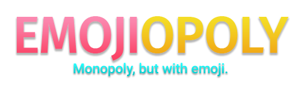

## About
Emojiopoly is a version of Monopoly that uses emoji instead of properties.
It currently supports up to 8 players.

## Where can I play?
You can play Emojiopoly at our website: [emojiopolyga.me](http://emojiopolyga.me).

## How do I play?
The rules are exactly the same as Monopoly.
These can be viewed at https://en.wikibooks.org/wiki/Monopoly/Official_Rules.

## House rules
| Rule                          | Description                                                                              | Type                                |
| :---------------------------- | :--------------------------------------------------------------------------------------- | :---------------------------------- |
| `needMonopolyToBuild`         | Whether players need a monopoly to build.                                                | `boolean`                           |
| `evenBuildRule`               | Improvements must be built on the property with the fewest buildings.                    | `boolean`                           |
| `rentInJail`                  | Whether players can collect rent in jail.                                                | `boolean`                           |
| `extraTurnOnRollingOutOfJail` | Whether an extra turns is awarded for rolling doubles to get out of jail.                | `boolean`                           |
| `tradeOutOfBankruptcy`        | Whether players can trade to pay off a debt they cannot afford.                          | `boolean`                           |
| `bankCoversUnpaidRent`        | Whether the bank covers for unpaid rent when a player goes bankrupt.                     | `boolean`                           |
| `bankruptAssetsAlwaysToBank`  | Whether the bank repossesses the assets of a player who goes bankrupt to an opponent.    | `boolean`                           |
| `purchaseMortgagedProperties` | Whether players can buy mortgaged properties from the bank.                              | `boolean`                           |
| `freeParkingJackpot`          | The money awarded to a player when landing on Free Parking.                              | `number \| "fines"`                 |
| `goSalary`                    | The money awarded to a player when they pass Go.                                         | `number`                            |
| `landOnGo`                    | What happens when a player lands on Go.                                                  | `"normal" \| "double" \| "freemove"`|
| `startingMoney`               | The amount of money players start with.                                                  | `number`                            |
| `turnsInJail`                 | How many turns a player is allowed to stay in jail for before being forced to post bail. | `number`                            |
| `bailAmount`                  | The amount of money a player needs to spend to pay to get out of jail.                   | `number`                            |
| `maxConsecutiveDoubles`       | The number of consecutive doubles a player is allowed to roll before being sent to jail. | `number`                            |
| `houseLimit`                  | The number of houses available.                                                          | `number`                            |
| `hotelLimit`                  | The number of hotels available. Max 22.                                                  | `number`                            |
| `mortgageRate`                | The percentage of the purchase price earned when a player mortgages a property.          | `number`                            |
| `unmortgageRate`              | The percentage of the purchase price spent when a player unmortgages a property.         | `number`                            |
| `maintenanceRate`             | The percentage of the purchase price spent per property per turn.                        | `number`                            |
| `incomeTax`                   | The money that must be paid when landing on income tax.                                  | `number`                            |
| `superTax`                    | The money that must be paid when landing on super tax.                                   | `number`                            |

## License
This project's code is licensed under the [MIT](\LICENSE) license.

This project's icon uses the money bag emoji from Twitter's Twemoji project.
Twemoji are licensed under a Creative Commons 4.0 license.
https://creativecommons.org/licenses/by/4.0/

Have fun! 🍆
